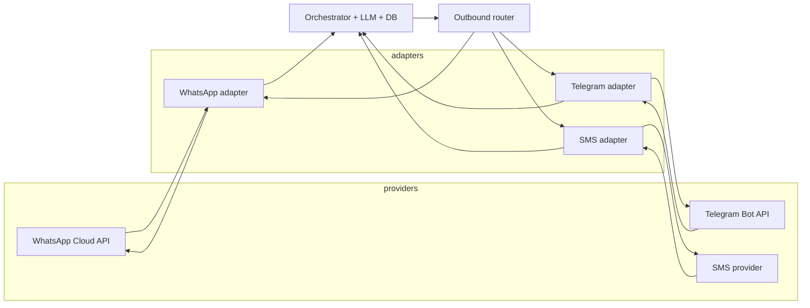
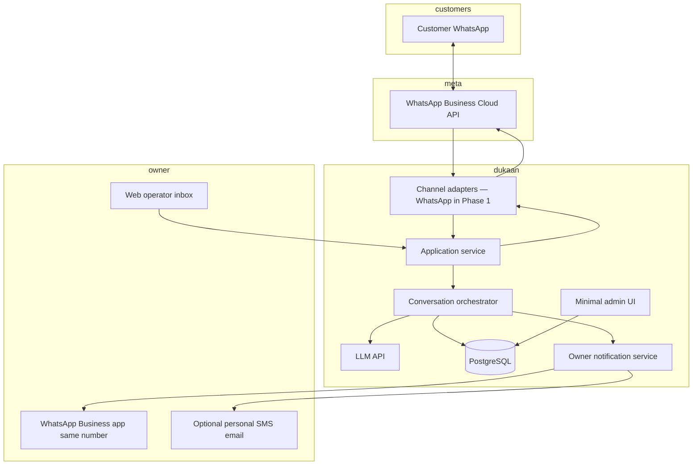

# DukaanAssist — Architecture

**Version:** 1.4  
**Phase:** 1 — Text-only WhatsApp  
**ICP:** **Travel agencies** only  
**Assumption:** Each agency uses a **WhatsApp Business phone number** as the customer-facing line (not a personal consumer account).

---

## 1. Goals

- Ingest customer messages through **channel adapters** (Phase 1: **WhatsApp Business Platform** only).
- Generate replies in **the customer’s language** (Hindi, Hinglish, English) using **only** approved business facts (static FAQ + profile), with a **natural, non-robotic** tone.
- **Detect intent**, capture **leads**, and **escalate** to the owner when needed.
- If the owner is **unavailable**, continue with **safe**, bounded automation (no guessing beyond FAQ).
- **Minimal infrastructure** — single deployable, one database, lowest practical cost.

---

## 2. WhatsApp Business number + Cloud API

**Baseline:** The **travel agency** operates a **WhatsApp Business** phone number — the same number on ads, Google Business, and “Message us on WhatsApp.” Customers message that **business line**; DukaanAssist connects it to **WhatsApp Business Platform (Cloud API)** so automation is first-class and compliant.

- **Inbound:** Meta sends customer messages to your **webhook**; your service decides bot vs human-pending.
- **Outbound:** Replies go through the **Cloud API** as that **same business number**, so the customer always sees one consistent business identity.
- **Owner alerts:** Escalations can go to the **owner’s WhatsApp Business app** on that number (where Meta **coexistence** / notification patterns allow), **and/or** a **secondary channel** (e.g. personal WhatsApp, SMS, email) with a link to a **light web operator inbox** — configurable per tenant in MVP.
- **Takeover:** Owner continues the thread **as the business** via the **web operator UI** (sends through Cloud API) or, where supported, native flows; if the owner is busy, the bot keeps handling with **safe** FAQ-only replies until they step in.

**Product promise to pilots:** “Travelers message your **WhatsApp Business number** as today; they get fast replies in their language, and you get **pings** when you need to take over.”

---

## 3. Messaging platform isolation (channel adapters)

**Intent:** The **conversation orchestrator**, LLM, FAQ, leads, and persistence must **not** depend on WhatsApp-specific shapes. WhatsApp is the **first** customer channel in Phase 1; **Telegram**, **SMS**, or other text channels plug in the same way later.

**Pattern:**

| Piece | Responsibility |
|--------|----------------|
| **Channel adapter (inbound)** | Own HTTP webhook (or polling, if a provider requires it): verify authenticity **per provider**, parse payload, **dedupe** using provider message ids (`wamid`, Telegram `update_id` + message id, SMS `MessageSid`, etc.). |
| **Normalized inbound event** | A single internal structure passed to the app layer, e.g. `tenant_id` (or resolvable routing key), `channel` (`whatsapp` \| `telegram` \| `sms` \| …), stable **thread** id and **sender** id **as strings** (WA user id, Telegram `chat_id`, E.164 for SMS — do not assume all channels are phone-based). |
| **Application + orchestrator** | Channel-agnostic: load context, run LLM, persist, decide escalation — only uses normalized ids + `channel`. |
| **Outbound router** | Given `channel` + tenant config, calls the correct send implementation (Graph API, Telegram `sendMessage`, SMS REST API). Templates and window rules stay **inside** each adapter. |

**Identity note:** Linking the “same person” across Telegram vs SMS vs WhatsApp is a **product** choice (optional future `contacts` / linking table). The default is **one conversation thread per (business, channel, channel-native sender id)**.

**Phase 1:** Implement **only** the WhatsApp adapter end-to-end; keep function boundaries and types as if other adapters exist (no Graph API types leaking into orchestrator code).

**Owner / operator UI:** Sends a reply with a **target channel** (for MVP, always WhatsApp for customer-facing thread). Multi-channel inbox is a later UX concern; storage already supports `channel` on conversations.

---

## 4. Logical architecture

---

## 5. Request flow (happy path)

1. **Customer** sends text on a **connected channel** (Phase 1: **WhatsApp Business** number).
2. **Provider** hits your **channel adapter** webhook (Phase 1: Meta `POST`; verify signature, dedupe by `wamid` / message id).
3. **Adapter** emits a **normalized inbound event**; **application service** resolves **which business** (e.g. phone number ID / WABA config for WhatsApp; per-channel routing keys in config for others).
4. **Orchestrator** loads:
   - Conversation context (recent turns, optional rolling window),
   - `business_config` (name, hours, services, FAQ JSON, tone examples),
   - Policies (languages allowed, max reply length, forbidden topics → always escalate).
5. **LLM call** with:
   - System: role, languages, “use only FAQ/profile,” human-like style,
   - User message + context,
   - Optional: structured output for `intent`, `confidence`, `needs_human`, `lead_fields`.
6. **Post-process:** If `needs_human` or low confidence → **notify owner** + send customer a **polite holding** reply; if lead intent → **persist lead**.
7. **Persist** message pair and metadata to **Postgres**.
8. **Outbound router** sends the reply via the **same channel** (Phase 1: **Cloud API** `messages` endpoint).

---

## 6. Escalation and owner takeover

| Trigger | Customer sees | Owner sees |
|--------|----------------|------------|
| Low model confidence / “unknown” policy | Brief acknowledgment + “owner will confirm” | Notification with thread summary + customer phone |
| Explicit “manager / owner” | Same | High-priority template |
| High-value intent (package quote, custom itinerary) | Continues FAQ if possible; may ask qualifying questions | Lead card + optional immediate alert |

**Takeover (MVP):**

- Owner opens **operator UI** (or future deep link), sees thread, sends message → backend uses the **outbound router** for that thread’s `channel` (Phase 1: **Cloud API** from the **WhatsApp Business number**).
- **Timeout path:** If owner does not respond in **T minutes** (configurable), orchestrator sends a **safe** follow-up: e.g. “We’ve noted your request; someone will call you back” + stores lead — **no fabricated facts**.

---

## 7. Human-like tone (non-robotic)

Architecture supports this **without** a separate service:

- **Travel-agency** prompt snippets (packages, destinations, bookings, polite escalation).
- **2–3 few-shot examples** per agency during onboarding (owner-approved phrases).
- **Constraints:** Short messages, avoid bullet spam in chat, allow Hinglish code-mixing when user uses it.
- **Guardrails:** If FAQ does not contain the answer → **do not** invent → escalate or deflect.

---

## 8. Data model (conceptual)

| Entity | Purpose |
|--------|---------|
| `businesses` / `business_config` | Channel credentials and routing (e.g. WABA / phone number IDs for WhatsApp; bot token + webhook secret for Telegram; SMS origination numbers). FAQ JSON, languages, escalation rules (vertical fixed or `travel` for Phase 1). |
| `conversations` | `channel`, business id, **channel-native thread / sender ids** (opaque strings), internal thread key, status (bot / human_pending / human_active). |
| `messages` | `channel`, direction, text, timestamps, provider message id (dedupe), raw payload ref, intent, confidence |
| `leads` | Contact fields (phone when known), name, intent, notes, status; optional `source_channel`. |
| `owner_notifications` | Outbound alert log, delivery status |
| `daily_rollups` | Aggregates for summary job |

Indexes: e.g. `(business_id, channel, channel_sender_id, updated_at)` for conversation fetch; keep WhatsApp-only indexes during Phase 1 migration if the schema evolves incrementally.

---

## 9. Background jobs

- **Daily summary** (cron): aggregate counts (messages, leads, escalations) per business; send via WhatsApp **template** to owner or email if WhatsApp template limits apply.
- **Optional retry queue:** failed outbound sends (simple table + worker or in-process retry with backoff for MVP).

---

## 10. Security and abuse

- **Webhooks:** Verify each provider’s authenticity (e.g. Meta `X-Hub-Signature-256`; Telegram secret token; SMS provider signature or IP allowlist as documented).
- **Secrets:** Environment-based; no keys in repo.
- **Rate limit** per business and globally on webhook and send paths.
- **PII:** Minimize logs; redact in application logging.

---

## 11. Future hooks (not Phase 1)

- **Additional text channels:** Second/third adapters (Telegram, SMS) — same normalized event and outbound router; tenant onboarding gains channel-specific steps.
- **Voice:** New ingress (telephony) → same orchestrator with STT/TTS adapter.
- **pgvector** or external vector store if FAQ size grows beyond simple JSON retrieval.
- **Multi-location** businesses: `business_id` hierarchy.

---

## 12. Related documents

- `Tech-Stack.md` — concrete technology choices.
- `Executive-Project-Plan.md` — phases and travel-agency context.
- `Project Plan.md` — original week-by-week tasks.
