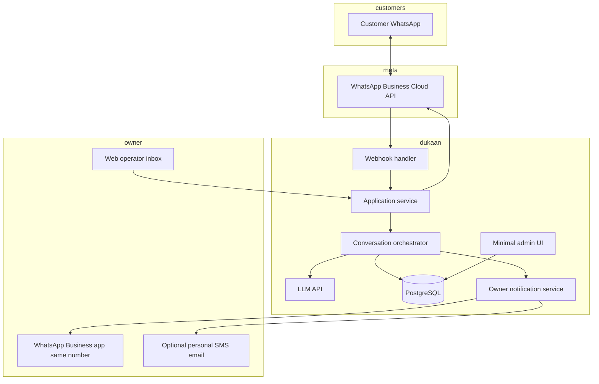

# DukaanAssist — Architecture

**Version:** 1.3  
**Phase:** 1 — Text-only WhatsApp  
**ICP:** **Travel agencies** only  
**Assumption:** Each agency uses a **WhatsApp Business phone number** as the customer-facing line (not a personal consumer account).

---

## 1. Goals

- Ingest customer messages from **WhatsApp Business Platform**.
- Generate replies in **the customer’s language** (Hindi, Hinglish, English) using **only** approved business facts (static FAQ + profile), with a **natural, non-robotic** tone.
- **Detect intent**, capture **leads**, and **escalate** to the owner when needed.
- If the owner is **unavailable**, continue with **safe**, bounded automation (no guessing beyond FAQ).
- **Minimal infrastructure** — single deployable, one database, lowest practical cost.

---

## 2. WhatsApp Business number + Cloud API

**Baseline:** The **travel agency** operates a **WhatsApp Business** phone number — the same number on ads, Google Business, and “Message us on WhatsApp.” Customers message that **business line**; DukaanAssist connects it to **WhatsApp Business Platform (Cloud API)** so automation is first-class and compliant.

- **Inbound:** Meta sends customer messages to your **webhook**; your service decides bot vs human-pending.
- **Outbound:** Replies go through the **Cloud API** as that **same business number**, so the customer always sees one consistent business identity.
- **Owner alerts:** Escalations can go to the **owner’s WhatsApp Business app** on that number (where Meta **coexistence** / notification patterns allow), **and/or** a **secondary channel** (e.g. personal WhatsApp, SMS, email) with a link to a **light web operator inbox** — configurable per tenant in MVP.
- **Takeover:** Owner continues the thread **as the business** via the **web operator UI** (sends through Cloud API) or, where supported, native flows; if the owner is busy, the bot keeps handling with **safe** FAQ-only replies until they step in.

**Product promise to pilots:** “Travelers message your **WhatsApp Business number** as today; they get fast replies in their language, and you get **pings** when you need to take over.”

---

## 3. Logical architecture

---

## 4. Request flow (happy path)

1. **Customer** sends text to the agency’s **WhatsApp Business** number.
2. **Meta** delivers `POST` webhook to your **webhook handler** (verify signature, dedupe by `wamid` / message id).
3. **Application service** resolves **which business** (phone number ID / WABA config).
4. **Orchestrator** loads:
   - Conversation context (recent turns, optional rolling window),
   - `business_config` (name, hours, services, FAQ JSON, tone examples),
   - Policies (languages allowed, max reply length, forbidden topics → always escalate).
5. **LLM call** with:
   - System: role, languages, “use only FAQ/profile,” human-like style,
   - User message + context,
   - Optional: structured output for `intent`, `confidence`, `needs_human`, `lead_fields`.
6. **Post-process:** If `needs_human` or low confidence → **notify owner** + send customer a **polite holding** reply; if lead intent → **persist lead**.
7. **Persist** message pair and metadata to **Postgres**.
8. **Send reply** via **Cloud API** `messages` endpoint.

---

## 5. Escalation and owner takeover

| Trigger | Customer sees | Owner sees |
|--------|----------------|------------|
| Low model confidence / “unknown” policy | Brief acknowledgment + “owner will confirm” | Notification with thread summary + customer phone |
| Explicit “manager / owner” | Same | High-priority template |
| High-value intent (package quote, custom itinerary) | Continues FAQ if possible; may ask qualifying questions | Lead card + optional immediate alert |

**Takeover (MVP):**

- Owner opens **operator UI** (or future deep link), sees thread, sends message → backend sends via **same** Cloud API **from the WhatsApp Business number**.
- **Timeout path:** If owner does not respond in **T minutes** (configurable), orchestrator sends a **safe** follow-up: e.g. “We’ve noted your request; someone will call you back” + stores lead — **no fabricated facts**.

---

## 6. Human-like tone (non-robotic)

Architecture supports this **without** a separate service:

- **Travel-agency** prompt snippets (packages, destinations, bookings, polite escalation).
- **2–3 few-shot examples** per agency during onboarding (owner-approved phrases).
- **Constraints:** Short messages, avoid bullet spam in chat, allow Hinglish code-mixing when user uses it.
- **Guardrails:** If FAQ does not contain the answer → **do not** invent → escalate or deflect.

---

## 7. Data model (conceptual)

| Entity | Purpose |
|--------|---------|
| `businesses` / `business_config` | WABA IDs, agency name, FAQ JSON, languages, escalation rules (vertical fixed or `travel` for Phase 1) |
| `conversations` | Thread id, customer wa id, business id, status (bot / human_pending / human_active) |
| `messages` | Direction, text, timestamps, raw payload ref, intent, confidence |
| `leads` | Phone, name, intent, notes, status |
| `owner_notifications` | Outbound alert log, delivery status |
| `daily_rollups` | Aggregates for summary job |

Indexes on `(business_id, customer_phone, updated_at)` for conversation fetch.

---

## 8. Background jobs

- **Daily summary** (cron): aggregate counts (messages, leads, escalations) per business; send via WhatsApp **template** to owner or email if WhatsApp template limits apply.
- **Optional retry queue:** failed outbound sends (simple table + worker or in-process retry with backoff for MVP).

---

## 9. Security and abuse

- **Webhook:** Verify Meta `X-Hub-Signature-256`.
- **Secrets:** Environment-based; no keys in repo.
- **Rate limit** per business and globally on webhook and send paths.
- **PII:** Minimize logs; redact in application logging.

---

## 10. Future hooks (not Phase 1)

- **Voice:** New ingress (telephony) → same orchestrator with STT/TTS adapter.
- **pgvector** or external vector store if FAQ size grows beyond simple JSON retrieval.
- **Multi-location** businesses: `business_id` hierarchy.

---

## 11. Related documents

- `Tech-Stack.md` — concrete technology choices.
- `Executive-Project-Plan.md` — phases and travel-agency context.
- `Project Plan.md` — original week-by-week tasks.
