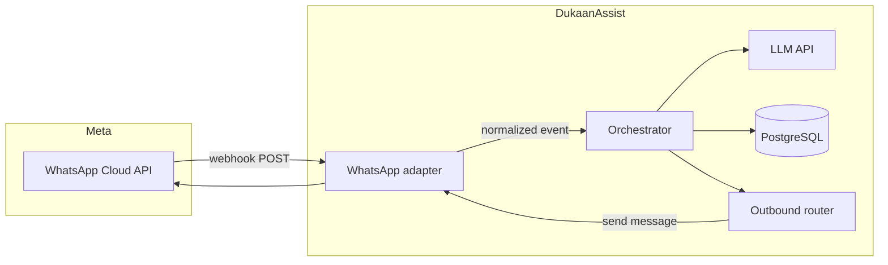

# DukaanAssist — Phase 1 execution guide

**Version:** 1.0  
**Audience:** Engineers and operators shipping the Phase 1 MVP  
**ICP (Phase 1):** Travel agencies only — **text on WhatsApp** via **WhatsApp Business Platform (Cloud API)** on the agency’s public business number.

Execute the tracks below **in order** where dependencies exist. **Tracks A (Meta/compliance) and B (infra)** can start in parallel before application code. **Tracks C–F** form the vertical slice (receive → reply); **G–I** add business value; **J** gates pilots.

**Related documents:** [Executive-Project-Plan.md](Executive-Project-Plan.md) (phase definition), [Project Plan.md](Project%20Plan.md) (week-by-week sketch), [Architecture.md](Architecture.md) (flows, adapters, data model), [Tech-Stack.md](Tech-Stack.md) (concrete stack choices).

---

## Happy path (reference)

---

## Phase 1 exit criteria (ship checklist)

Use this list to confirm Phase 1 is done before calling pilots “live.”

- [ ] **Inbound:** Customer messages the agency **WhatsApp Business number**; your **HTTPS webhook** receives Meta payloads, verifies authenticity, and **dedupes** by provider message id (`wamid`).
- [ ] **Replies:** Bot responds in the **customer’s language** (Hindi, Hinglish, English) using **only** configured **FAQ + profile**; no invented prices, visa rules, or availability.
- [ ] **Persistence:** Conversations and messages stored in **PostgreSQL** with **channel** and provider ids; business config (FAQ, tone, routing) loadable per tenant.
- [ ] **Leads:** High-value threads yield **structured lead records** (e.g. phone, name, intent, notes) in a `leads` table (or equivalent).
- [ ] **Escalation:** When confidence is low, the user asks for a human, or policy requires it, the **owner is notified** with enough context to act; customer gets a **safe holding** reply.
- [ ] **Daily summary:** A scheduled job produces **per-business rollups** (messages, leads, missed/escalation signals) and delivers a summary (**WhatsApp template** and/or **email**, per your setup).
- [ ] **Minimal admin:** Owners (or you) can **edit FAQ and business profile** without redeploying code (Streamlit or simple HTML + FastAPI is enough).
- [ ] **Compliance baseline:** WABA + Cloud API path documented; **privacy policy URL** and **data retention** awareness aligned with what you store (see [Tech-Stack.md](Tech-Stack.md) §7).

Out of scope for Phase 1: voice, live inventory, payments, heavy analytics dashboards, Kubernetes — see [Executive-Project-Plan.md](Executive-Project-Plan.md) §3.

---

## Track A — Product / Meta / compliance

Complete these before or alongside early backend work.

1. [ ] Create or use a **Meta Business Portfolio** and a **WhatsApp Business Account (WABA)** for each pilot (or a single WABA with multiple numbers, per your commercial setup).
2. [ ] Connect the agency’s **WhatsApp Business phone number** to the platform; complete **display name** and verification steps Meta requires.
3. [ ] Create a **Meta app** with **WhatsApp** / **Cloud API** product; obtain **App ID**, **App Secret**, and **permanent access token** (or token flow you will use in production).
4. [ ] Note the **Phone Number ID** (and any **WABA ID**) for each connected number — you will map these to `business_id` in config.
5. [ ] Prepare a **public HTTPS webhook URL** (no self-signed certs in production); plan **GET** verification (`hub.verify_token`) and **POST** message delivery.
6. [ ] Configure **webhook fields** (at minimum **messages**; add others only as needed per Meta docs).
7. [ ] Implement **signature verification** using **App Secret** and `X-Hub-Signature-256` on every inbound POST (see [Architecture.md](Architecture.md) §10).
8. [ ] **Subscribe** the app to the WhatsApp Business Account / number per Meta’s flow so webhooks actually fire.
9. [ ] Draft **2–3 message templates** early for **owner alerts** and any **utility** sends that may fall outside the customer **24-hour service window** (templates are often required — see [Tech-Stack.md](Tech-Stack.md) §2).
10. [ ] Publish or link a **privacy policy** URL suitable for Meta review and pilot trust.
11. [ ] **Optional — Twilio for WhatsApp:** If you choose Twilio instead of direct Cloud API for speed of first webhook, repeat equivalent steps in Twilio’s console (higher per-message cost tradeoff — [Tech-Stack.md](Tech-Stack.md) §1).

---

## Track B — Infrastructure

1. [ ] Provision **one small always-on host** (VPS or smallest PaaS tier) — see [Tech-Stack.md](Tech-Stack.md) §4.
2. [ ] Install **PostgreSQL** on the same host *or* use **managed Postgres** (Neon, Supabase, RDS, etc.).
3. [ ] Put **Caddy** or **nginx** in front of the app with **Let’s Encrypt** TLS for the webhook hostname.
4. [ ] Store **secrets in environment variables** (App Secret, verify tokens, DB URL, LLM keys, Meta tokens); never commit secrets.
5. [ ] Run the API under **systemd** or **Docker Compose** with restart policy.
6. [ ] **Optional:** Daily `pg_dump` (or managed backup) and a simple **uptime** check / log tail alert.

---

## Track C — Application skeleton

1. [ ] Bootstrap **Python 3.11+** with **FastAPI** ([Tech-Stack.md](Tech-Stack.md) §1).
2. [ ] Add **`GET /health`** (and optionally **`GET /ready`** with DB ping).
3. [ ] Configure **structured logging**; **minimize PII** in logs and redact phone numbers where possible ([Architecture.md](Architecture.md) §10).
4. [ ] Add **rate limiting** on webhook and outbound send paths: **global** cap plus **per-tenant** cap ([Architecture.md](Architecture.md) §10).
5. [ ] Define a single place for **configuration** (env + per-business rows in DB).

---

## Track D — Data model and migrations

Implement the **conceptual** model from [Architecture.md](Architecture.md) §8 in dependency order. Use **Alembic** or versioned SQL; names can match your ORM conventions.

1. [ ] **`businesses` / `business_config`:** Agency name, description, FAQ JSON, languages, tone examples, **WhatsApp routing** (phone number id → business), escalation preferences, optional owner notification targets.
2. [ ] **`conversations`:** `business_id`, **`channel`** (`whatsapp` in Phase 1), **channel-native thread/sender ids** (strings), **status** (`bot` / `human_pending` / `human_active`), timestamps.
3. [ ] **`messages`:** Link to conversation; **direction** (in/out); **text**; **provider message id** for **dedupe**; optional intent, confidence, raw payload reference.
4. [ ] **`leads`:** Phone (when known), name, intent, notes, status, optional `source_channel`, link to conversation if useful.
5. [ ] **`owner_notifications`:** Alert type, payload summary, delivery channel, status.
6. [ ] **`daily_rollups`** (or equivalent): Per business, per day — counts for messages, leads, escalations / “missed” signals for the summary job.
7. [ ] Add **indexes** suited to your queries, e.g. `(business_id, channel, channel_sender_id, updated_at)` for conversation fetch ([Architecture.md](Architecture.md) §8).

**Week 1 minimal schema note:** [Project Plan.md](Project%20Plan.md) shows a smaller starter (`business_config`, `conversations` with message/response columns). Prefer evolving toward the **normalized** `messages` table above so Week 2–3 features do not require a painful migration.

---

## Track E — WhatsApp adapter (inbound / outbound)

Keep **Graph API shapes** inside the adapter; the rest of the app sees **normalized events** only ([Architecture.md](Architecture.md) §3, §5).

### Inbound

1. [ ] Expose **`POST /webhook/whatsapp`** (path is arbitrary; this matches [Project Plan.md](Project%20Plan.md)).
2. [ ] Handle **GET** verification with `hub.verify_token` and `hub.challenge`.
3. [ ] On POST: verify **`X-Hub-Signature-256`**, parse payload, extract entries.
4. [ ] **Dedupe** using `wamid` (or equivalent) — ignore duplicates safely.
5. [ ] Map payload to **normalized inbound event:** `tenant_id` / `business_id`, `channel=whatsapp`, **thread id**, **sender id**, **text**, timestamps, raw ids.
6. [ ] **Resolve tenant:** incoming **phone number id** (or your chosen routing key) → `business_id`.

### Outbound

7. [ ] Implement **outbound router** method: given `business_id`, recipient id, text (and later templates), call Graph **`/{phone-number-id}/messages`** with the correct auth ([Tech-Stack.md](Tech-Stack.md) §2).
8. [ ] Centralize **template vs session message** rules inside the adapter (24-hour window, approved templates).

---

## Track F — Orchestrator + LLM

1. [ ] On each normalized inbound event, **load or create** the conversation row for `(business_id, channel, sender)`.
2. [ ] Load **recent message history** (rolling window) and **`business_config`** (FAQ JSON, profile, rules).
3. [ ] Call the **LLM** with a **system prompt** aligned with [Project Plan.md](Project%20Plan.md): travel agency role, FAQ-only facts, same language as user, concise human tone, escalate when unsure.
4. [ ] Use **structured output** for at least: `reply_text`, `intent`, `confidence`, `needs_human`, optional **`lead`** fields — *or* a **cheap classifier** pass + main generation pass ([Tech-Stack.md](Tech-Stack.md) §3).
5. [ ] **Post-process:** clamp length, strip disallowed content if any, ensure empty reply never goes out.
6. [ ] **Persist** inbound and outbound messages to **`messages`** (and update conversation `updated_at` / status as needed).
7. [ ] Invoke **outbound router** to send `reply_text` to the customer.

This completes the **Week 1** vertical slice: “receive → FAQ-grounded reply → save” ([Project Plan.md](Project%20Plan.md) Week 1).

---

## Track G — Lead capture and escalation

### Intent set (align with product)

Use a fixed vocabulary (extend only with care) — from [Project Plan.md](Project%20Plan.md):

- `package_inquiry`
- `destination_info`
- `price_quote`
- `booking_intent`
- `visa_documents`
- `support`
- `unknown`

### Lead capture

1. [ ] When intent is **high value** (e.g. `booking_intent`, `price_quote`, `package_inquiry`) or when the structured output includes **lead fields**, run **lead capture flow**: ask for **name** and **requirement** if missing ([Project Plan.md](Project%20Plan.md) Week 2).
2. [ ] **Upsert** `leads` with phone, name, intent, latest message summary, `status` (e.g. new / contacted).

### Escalation triggers

3. [ ] **Notify owner** when: **low confidence**, **`needs_human`**, explicit **owner/manager** request, **complex** policy topics, or **booking / quote** intent per your rules ([Architecture.md](Architecture.md) §5–6).
4. [ ] **Customer message:** short acknowledgment + **owner will confirm** / callback — **no new facts** beyond FAQ.
5. [ ] **Owner message:** include **name**, **phone/sender id**, **intent**, **thread summary**, and deep link or instructions to **web operator inbox** if implemented ([Executive-Project-Plan.md](Executive-Project-Plan.md) §4).
6. [ ] **Optional timeout path:** if owner does not respond in **T minutes** (configurable), send **safe** follow-up and ensure lead is stored — still **no fabricated facts** ([Architecture.md](Architecture.md) §6).

### Smart replies (Week 2 polish)

7. [ ] If FAQ lists packages/destinations, **suggest 2–3 options** only from FAQ; if not in FAQ, **hand off** or offer callback ([Project Plan.md](Project%20Plan.md) Week 2).

---

## Track H — Daily summary

1. [ ] Implement a **scheduled job** (cron, APScheduler, or separate worker process) that runs **once per day** per business ([Architecture.md](Architecture.md) §9).
2. [ ] Aggregate: **total messages**, **leads generated**, **escalations** / **missed-query** counts (however you flag “LLM fallback” in DB — [Project Plan.md](Project%20Plan.md) Week 3).
3. [ ] Write results to **`daily_rollups`**.
4. [ ] **Deliver** summary via **WhatsApp template** to owner and/or **email**, depending on template availability and pilot preference ([Project Plan.md](Project%20Plan.md) Must Have; [Tech-Stack.md](Tech-Stack.md) §2).

---

## Track I — Minimal admin

1. [ ] **Streamlit** or **HTML + FastAPI:** forms to edit **FAQ JSON** and **business profile** (name, description, hours, regions).
2. [ ] **Optional onboarding flow** ([Project Plan.md](Project%20Plan.md) Week 3): collect agency name, focus regions, top packages/destinations, typical price bands (for FAQ only — owner responsibility), contact/hours; optionally generate **FAQ draft** + **prompt context** for review.
3. [ ] Protect admin with **auth** (even HTTP basic + VPN, or single shared secret for pilots) — do not leave open on the public internet.

---

## Track J — Verification before pilots

| Area | What to verify |
|------|------------------|
| **Security** | Invalid signature rejected; verify token mismatch returns 403. |
| **Dedupe** | Same `wamid` replay does not double-process or double-reply. |
| **FAQ boundary** | Questions outside FAQ yield **safe** reply + escalation flag, not invented visa/price. |
| **Languages** | Hindi, Hinglish, English sample threads sound natural and match user script/mix. |
| **Leads** | High-value intents create/update `leads` with correct phone linkage. |
| **Escalation** | Owner notification received; customer sees holding message. |
| **Summary** | Job runs, rollups correct against manual counts for a test day. |
| **Reliability** | Rate limits behave; app recovers after Postgres restart. |

Success metrics to track after go-live are summarized in [Executive-Project-Plan.md](Executive-Project-Plan.md) §8.

---

## Suggested sequencing (calendar)

Rough mapping to [Project Plan.md](Project%20Plan.md):

| Week | Focus | Tracks (primary) |
|------|--------|-------------------|
| **1** | Core chat | A (partial), B, C, D (minimal → messages table), E, F |
| **2** | Leads + escalation | D (leads, notifications), G |
| **3** | Sellable MVP | H, I, A (templates/compliance polish), J |

---

## Document map

| Document | Purpose |
|----------|---------|
| [Executive-Project-Plan.md](Executive-Project-Plan.md) | Strategy, ICP, phases, success metrics |
| [Project Plan.md](Project%20Plan.md) | Original week-by-week engineering sketch |
| [Architecture.md](Architecture.md) | System design, adapter pattern, flows, conceptual schema |
| [Tech-Stack.md](Tech-Stack.md) | Stack choices, Meta/TLS, LLM pattern, compliance checklist |
| [Pricing.md](Pricing.md) | Commercial pricing outline (no sensitive numbers in repo) |
| **Phase-1-Execution-Guide.md** (this file) | Ordered execution checklist for Phase 1 MVP |
